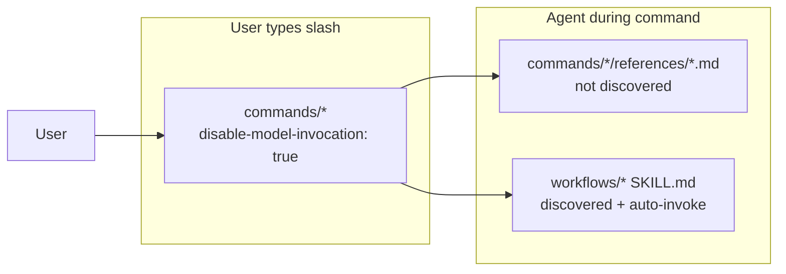

# slash-menu-workflow-visibility - Implementation Plan

## Task Details

| Field            | Value                                                                 |
| ---------------- | --------------------------------------------------------------------- |
| Jira ID          | —                                                                     |
| Title            | Clarify and reduce workflow skills visible in Cursor `/` slash menu   |
| Description      | User sees workflow skills (e.g. `tsh-code-reviewing`, `tsh-committing`) alongside commands (`/tsh-review`, `/tsh-commit`) in the `/` palette. Plan a consistent policy: what should appear as user-facing slash commands vs agent-only knowledge. |
| Priority         | Medium                                                                |
| Related Research | `specifications/decisions/hide-committing-from-slash-menu.decision.md`, `specifications/decisions/commit-command-vs-committing-workflow.decision.md` |

## Proposed Solution

**Root cause (not repo-specific bug):** Cursor indexes every `SKILL.md` under `.cursor/skills/` (`name` + `description` at discovery). Entries in `workflows/` omit `disable-model-invocation: true` by design (`tsh-migrating-copilot-to-cursor`: workflows auto-load for agents). That combination means **~36 workflow skills appear in `/` in addition to ~16 commands** (and some `internal/` skills may also appear).

**Intended model vs actual UI:**

| Layer | Folder | Count | Designed for user `/` | Actually in `/` today |
| ----- | ------ | ----- | --------------------- | --------------------- |
| Commands | `commands/` | 16 | Yes | Yes |
| Workflows | `workflows/` | 36 | No (agent loads via Required Skills) | **Yes** |
| Internal | `internal/` | 11 | No | Sometimes |
| Agents | `agents/` | 16 | Via `@agent`, not skills slash | N/A |

**Policy (recommended):** Adopt a **tiered visibility model** — do not bulk-delete workflow skills (breaks auto-invocation); migrate **Tier A** duplicates to `commands/<cmd>/references/*.md` and document **Tier B** shared workflows in README as agent-only.

## Current Implementation Analysis

### Already Implemented

- **16 slash commands** in `.cursor/skills/commands/` — all have `disable-model-invocation: true`
- **Command → workflow wiring** — e.g. `/tsh-review` Required Skills lists `tsh-code-reviewing`; `/tsh-review-ui` lists `tsh-ui-verifying`
- **ADR for `tsh-committing`** — `hide-committing-from-slash-menu.decision.md` (Option 1: move to `references/`)
- **Documentation** — README says “Type `/` to see available slash commands” but does not warn that workflows also appear

### To Be Modified

- `README.md` — “How to Use” section: explain `/` lists commands **and** workflow skills; point users to command list only
- `tsh-creating-commands/SKILL.md` — add note: pairing command + workflow with similar names causes menu clutter; prefer `references/` for 1:1 backing content
- `tsh-creating-skills/SKILL.md` — same guidance for new workflow skills
- Per-pair migrations (see phases below)

### To Be Created

- `specifications/decisions/slash-menu-visibility-policy.decision.md` — ACCEPTED tier policy (after user review)
- Optional: `website/docs/for-ctos.md` or getting-started blurb — one paragraph on slash menu behavior

### Command ↔ workflow inventory

**Tier A — High confusion (dedicated command + overlapping name/meaning → migrate to `references/`)**

| Workflow skill | User-facing command | Slash clutter |
| -------------- | ------------------- | ------------- |
| `tsh-committing` | `/tsh-commit` | `commit` + `committing` |
| `tsh-code-reviewing` | `/tsh-review`, also used by `/tsh-refactor` | `review` + `code-reviewing` |
| `tsh-ui-verifying` | `/tsh-review-ui` | `review-ui` + `ui-verifying` |

**Tier B — Shared infrastructure (no single command; keep `workflows/*.md` SKILL)**

Loaded by many commands/agents; auto-discovery is valuable; names differ enough from commands:

- `tsh-technical-context-discovering`
- `tsh-codebase-analysing` (also `/tsh-review-codebase` — **medium** confusion; optional Tier A later)
- `tsh-implementation-gap-analysing`
- `tsh-architecture-designing`, `tsh-sql-and-database-understanding`, `tsh-engineering-prompts`
- Domain stacks: `tsh-implementing-backend`, `tsh-implementing-frontend`, `tsh-e2e-testing`, etc.

**Tier C — Command-orchestrated only (only via one command; lower priority)**

| Workflow | Primary command |
| -------- | ----------------- |
| `tsh-transcript-processing` | `/tsh-analyze-materials` |
| `tsh-task-extracting` | `/tsh-analyze-materials` |
| `tsh-task-quality-reviewing` | `/tsh-analyze-materials` |
| `tsh-jira-task-formatting` | `/tsh-analyze-materials` |
| `tsh-optimizing-cloud-cost` | `/tsh-analyze-aws-costs`, `/tsh-analyze-gcp-costs`, `/tsh-audit-infrastructure` |
| `tsh-creating-agents` | `/tsh-create-custom-agent` |
| `tsh-creating-skills` | `/tsh-create-custom-skill` |
| `tsh-creating-commands` | `/tsh-create-custom-command` |
| `tsh-creating-rules` | `/tsh-create-custom-rules` |

**Tier D — Meta / migration (acceptable in `/` for maintainers or defer)**

- `tsh-migrating-copilot-to-cursor`, `tsh-creating-commands`, `tsh-creating-rules`

## Open Questions

| #   | Question | Answer | Status |
| --- | -------- | ------ | ------ |
| 1   | Should Tier B workflows stay in `/` menu? | **Yes for v1** — keep SKILL for auto-invoke; document as agent-only in README | ✅ Resolved |
| 2   | Bulk-migrate all 36 workflows to references? | **No** — breaks auto-discovery; high churn; only Tier A in v1 | ✅ Resolved |
| 3   | Add `disable-model-invocation: true` to all workflows to hide? | **No** — violates migration rules; does not hide reliably; blocks auto-invoke | ✅ Resolved |
| 4   | Is `/tsh-code-reviewing` ever intended as user entry? | **No** — use `/tsh-review`; workflow is backing knowledge | ✅ Resolved |

## Technical Context

### Project Instructions

- Commands: `.cursor/skills/commands/<name>/SKILL.md`, `disable-model-invocation: true`
- Workflows: `.cursor/skills/workflows/<name>/SKILL.md`, no `disable-model-invocation`
- Internal: `.cursor/skills/internal/`, `disable-model-invocation: true`, description “Not user-invokable”
- Reference files under `references/` are **not** separate skills — not listed in discovery index

### Architecture & Patterns

- **Progressive disclosure** (`tsh-creating-skills`): discovery loads `name` + `description` only; full body on activation
- **Reference depth**: one level under command `SKILL.md` (`references/foo.md`)
- **Cross-references**: grep `tsh-committing`, `tsh-code-reviewing`, `tsh-ui-verifying` across `.cursor/skills/` after moves

### Tech Stack

- Markdown skills only; Cursor Agent chat slash palette

### Code Style & Standards

- English skill content; update Required Skills to `Read .cursor/skills/commands/<cmd>/references/<file>.md` instead of `Load tsh-*` where migrated
- Keep workflow **name** in prose as logical label even if file moves (e.g. “Conventional Commits rules (references/conventional-commits.md)”)

### Testing Patterns

- Manual: after each Tier A migration, type `/` — duplicate entry gone; run parent command — agent still loads reference
- Grep: no broken `tsh-committing` paths

### Additional Context

- Cursor may change skill discovery flags — track [Cursor Skills docs](https://cursor.com/docs/context/skills) / forum for `user-invocable` equivalent
- `internal/` skills with `disable-model-invocation: true` may still appear — out of scope unless reproducible

## Implementation Plan

### Phase 1: Policy and documentation

#### Task 1.1 - [CREATE] ADR `slash-menu-visibility-policy.decision.md`

**Description**: Codify Tier A/B/C/D, command-vs-workflow vs references, and “workflows in `/` are expected until migrated”.

**Definition of Done**:

- [ ] ADR in `specifications/decisions/` with status ACCEPTED after user confirmation
- [ ] Links to hide-committing ADR

#### Task 1.2 - [MODIFY] README.md — slash menu guidance

**Description**: Under “How to Use”, add short subsection:

- `/` shows **commands** (intended) and **workflow skills** (for agents)
- User should prefer listed commands (`/tsh-review`, not `/tsh-code-reviewing`)
- Table or link to Tier A list

**Definition of Done**:

- [ ] README updated; repository structure command count corrected (16)

#### Task 1.3 - [MODIFY] `tsh-creating-commands` and `tsh-creating-skills`

**Description**: Add anti-pattern: “Do not add a workflow SKILL.md with a name similar to your command if the workflow is only loaded by that command — use `references/`.”

**Definition of Done**:

- [ ] Both skills mention reference-file pattern and Tier A examples

### Phase 2: Tier A migrations (high confusion pairs)

#### Task 2.1 - [MODIFY] `/tsh-commit` — move `tsh-committing` to references

**Description**: Implement `hide-committing-from-slash-menu.decision.md`:

- Create `commands/tsh-commit/references/conventional-commits.md` (content from workflow)
- Delete `workflows/tsh-committing/SKILL.md`
- Update `tsh-commit` Required Skills and Connected Skills
- Update ADRs and plan cross-links

**Definition of Done**:

- [ ] `tsh-committing` absent from `workflows/`
- [ ] `/` no longer shows `committing` (manual verify)
- [ ] `/tsh-commit` still documents CC rules via reference path

#### Task 2.2 - [MODIFY] `/tsh-review` — move `tsh-code-reviewing` to references

**Description**:

- `commands/tsh-review/references/code-reviewing.md`
- Delete `workflows/tsh-code-reviewing/SKILL.md`
- Update `tsh-review`, `tsh-refactor`, `tsh-review-codebase` Required Skills (refactor/codebase still need review standards — point to same reference or keep shared copy in refactor references — **prefer single canonical reference under `tsh-review/references/`** and symlink or duplicate path in refactor: “read tsh-review/references/code-reviewing.md”)

**Definition of Done**:

- [ ] No `workflows/tsh-code-reviewing/SKILL.md`
- [ ] All grep references updated
- [ ] `/tsh-review` workflow intact

#### Task 2.3 - [MODIFY] `/tsh-review-ui` — move `tsh-ui-verifying` to references

**Description**:

- `commands/tsh-review-ui/references/ui-verifying.md`
- Delete `workflows/tsh-ui-verifying/SKILL.md`
- Update `tsh-implement` UI paths if they reference `tsh-ui-verifying` skill name — point to reference or `tsh-review-ui/references/`

**Definition of Done**:

- [ ] No `workflows/tsh-ui-verifying/SKILL.md`
- [ ] `tsh-implement` / `tsh-implement-ui` internal paths updated

### Phase 3: Tier C optional backlog (document only in plan)

#### Task 3.1 - [CREATE] Backlog section in ADR or `improvements.md`

**Description**: List Tier C workflows for future reference migration if slash menu remains noisy; no implementation in this task.

**Definition of Done**:

- [ ] Prioritized list with command mapping
- [ ] No file moves in Phase 3 unless user expands scope

### Phase 4: Tier B documentation pass (no file moves)

#### Task 4.1 - [MODIFY] README — agent-only workflows

**Description**: Add appendix table “Workflow skills (agent-invoked, not recommended from `/`)” listing Tier B examples: `tsh-technical-context-discovering`, `tsh-implementing-backend`, etc.

**Definition of Done**:

- [ ] Users understand seeing them in `/` is normal; use commands for intent

## Security Considerations

- Reference files may contain security checklists (code review, secrets) — no change to sensitivity; path updates only
- No git or credential handling in this task

## Quality Assurance

- [ ] After Phase 2, `/` palette has fewer near-duplicate entries (committing, code-reviewing, ui-verifying gone)
- [ ] `/tsh-review`, `/tsh-review-ui`, `/tsh-commit` still complete end-to-end in Agent chat
- [ ] `grep -r "workflows/tsh-committing\|workflows/tsh-code-reviewing\|workflows/tsh-ui-verifying"` returns zero
- [ ] README accurately describes slash menu behavior
- [ ] Tier B workflows still exist under `workflows/` and remain auto-invokable

## Improvements (Out of Scope)

- Cursor platform flag to hide skills from `/` while keeping auto-invoke (watch docs)
- Migrate all Tier C workflows to references
- Rename Tier B skills with `internal-` prefix (does not remove discovery)
- Consolidate 36 workflows into fewer mega-skills
- VS Code / Cursor Settings UI to filter skills

## Changelog

| Date       | Change Description   |
| ---------- | -------------------- |
| 2026-05-21 | Initial plan created |
| 2026-05-21 | Implemented Phase 1–2 and README Tier A (via /tsh-implement) |
