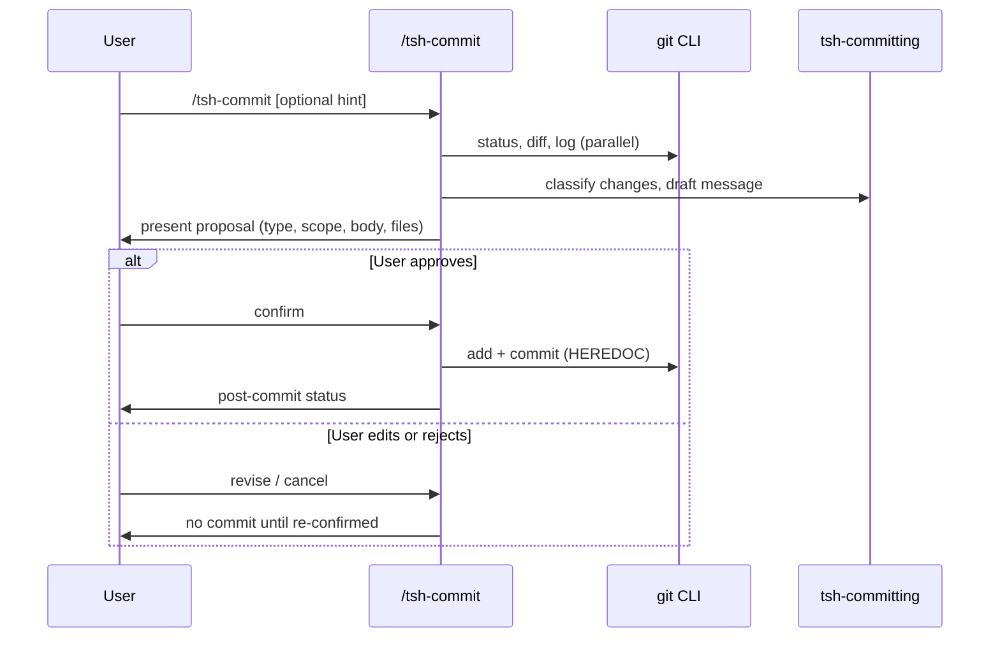

# tsh-commit - Implementation Plan

## Task Details

| Field            | Value                                                                 |
| ---------------- | --------------------------------------------------------------------- |
| Jira ID          | —                                                                     |
| Title            | Add `/tsh-commit` command for Conventional Commits with user approval |
| Description      | New slash command that analyzes staged/unstaged changes, drafts a [Conventional Commits 1.0.0](https://www.conventionalcommits.org/en/v1.0.0/) message, presents it to the user, and runs `git commit` only after explicit confirmation. |
| Priority         | Medium                                                                |
| Related Research | — (greenfield; Copilot-era “Git-committer agent” mentioned in CHANGELOG only, not present in Cursor setup) |

## Proposed Solution

Introduce a **command skill** `/tsh-commit` as the user-facing entry point and a **workflow skill** `tsh-committing` holding Conventional Commits rules and message-generation procedure. The command orchestrates git inspection, message drafting, a mandatory confirmation gate, and a safe commit execution.



**Design choices (resolved for planning):**

| Decision | Choice | Rationale |
| -------- | ------ | --------- |
| Entry point | Command skill only (`disable-model-invocation: true`) | Matches other user-triggered utilities (`tsh-ask`, `tsh-debug`) |
| Domain knowledge | Separate workflow skill `tsh-committing` | Per `tsh-creating-commands`: commands route; workflows hold spec details |
| Agent routing | None — self-contained command | Git commit is procedural; no implementation delegation needed (unlike `/tsh-implement`) |
| Confirmation | **Hard gate** — no `git commit` without explicit user approval | User requirement; aligns with Cursor user rule “only commit when requested” |
| Commit style | [Conventional Commits 1.0.0](https://www.conventionalcommits.org/en/v1.0.0/) | User requirement |
| Message delivery | HEREDOC for `git commit -m` | Matches established user git-safety rule; supports multi-line body |

## Current Implementation Analysis

### Already Implemented

- **Command skill patterns** — `.cursor/skills/commands/tsh-ask/SKILL.md`, `tsh-debug/SKILL.md`, `tsh-refactor/SKILL.md` — frontmatter (`disable-model-invocation: true`), Required Skills, Workflow, Constraints sections
- **Command creation guide** — `.cursor/skills/workflows/tsh-creating-commands/SKILL.md` — structure, validation checklist
- **Skill creation guide** — `.cursor/skills/workflows/tsh-creating-skills/SKILL.md` — frontmatter, progressive disclosure
- **Meta-command** — `.cursor/skills/commands/tsh-create-custom-command/SKILL.md` — can bootstrap similar artifacts if needed later
- **Repo commit history examples** — mix of Conventional (`feat:`, `chore:`, `docs(changelog):`) and free-form (`Enhance README...`) — command should prefer Conventional, not mimic inconsistent legacy messages

### To Be Modified

- `README.md` — add `/tsh-commit` under **Developer Utilities** (or new **Git / Workflow** bullet) and optional usage example in the commands section
- `website/docs/` — optional mirror page if other commands are documented there (verify parity during implementation; skip if no command docs pattern exists)

### To Be Created

- `.cursor/skills/commands/tsh-commit/SKILL.md` — slash command entry point
- `.cursor/skills/workflows/tsh-committing/SKILL.md` — Conventional Commits classification, message template, safety rules, optional `references/conventional-commits.md` for spec summary

## Open Questions

| #   | Question                                                                 | Answer | Status   |
| --- | ------------------------------------------------------------------------ | ------ | -------- |
| 1   | Should the command auto-split unrelated changes into multiple commits? | Recommend: **propose split** when `git diff` spans unrelated domains; user chooses single vs multiple commits before any `git add` | ✅ Resolved (plan default) |
| 2   | Should scope be mandatory?                                               | **Optional** — infer from paths (`docs`, `readme`, skill name) when obvious; omit when unclear | ✅ Resolved |
| 3   | Commit only staged files or stage all tracked changes?                   | **Default: stage only paths user confirms** in the proposal; never `git add -A` without listing files | ✅ Resolved |
| 4   | Push after commit?                                                       | **Never** unless user explicitly asks (out of scope) | ✅ Resolved |

## Technical Context

### Project Instructions

- Commands live in `.cursor/skills/commands/<name>/SKILL.md` with `disable-model-invocation: true`
- Workflow skills live in `.cursor/skills/workflows/<name>/SKILL.md`
- All public artifacts use `tsh-` prefix (see `specifications/decisions/artifact-prefix-choice.decision.md`)
- Command `name` must match directory name

### Architecture & Patterns

- **Separation**: command = workflow steps + gates; workflow skill = Conventional Commits rules + message format
- **No agent delegation** for this command (same pattern as `tsh-ask`)
- Reference workflow skills in command `Required Skills` section
- Keep command body under ~120 lines; move spec tables to `references/` if needed

### Tech Stack

- Markdown skills only; no application runtime
- Git CLI for inspection and commit

### Code Style & Standards

- Skill frontmatter: `name`, `description` (with “Use when…”), `disable-model-invocation: true` for commands
- Description shown in slash command menu — must mention Conventional Commits and confirmation requirement
- English for all skill content

### Testing Patterns

- Manual validation checklist (no automated test suite for skills):
  - Dirty working tree → proposes message → user rejects → no commit created
  - User approves → commit created with exact proposed message
  - Secret-like files (`.env`) in diff → warning, block unless user overrides explicitly
  - Empty changes → informative message, no commit

### Additional Context

- User Cursor rule `committing-changes-with-git` already defines safe git protocol — **workflow skill must align** (parallel status/diff/log, HEREDOC, no config changes, no `--no-verify`, no push unless asked)
- Historical Copilot “Git-committer agent” is **not** migrated — this plan replaces that capability in Cursor form

## Implementation Plan

### Phase 1: Workflow skill — Conventional Commits knowledge

#### Task 1.1 - [CREATE] `tsh-committing` workflow skill

**Description**: Create `.cursor/skills/workflows/tsh-committing/SKILL.md` with:

- Allowed types: `feat`, `fix`, `docs`, `style`, `refactor`, `perf`, `test`, `build`, `ci`, `chore`, `revert` (per [Conventional Commits](https://www.conventionalcommits.org/en/v1.0.0/) and common `@commitlint/config-conventional` set)
- Message structure: `<type>[optional scope]: <description>` + optional body + optional footers (`BREAKING CHANGE:`, `Refs:`)
- Rules for inferring type from diff (docs-only → `docs`, skill/command → `chore` or `feat` depending on new capability)
- Breaking change notation (`!` or footer)
- Anti-patterns: vague descriptions (“fix stuff”, “update”), mixing unrelated concerns in one commit
- Safety: never commit `.env`, credentials, keys; warn on suspicious paths

**Definition of Done**:

- [x] `SKILL.md` exists with valid frontmatter (`name: tsh-committing`, description with trigger phrases)
- [x] Message template and type decision table documented
- [x] Breaking change and `revert` type documented with examples
- [x] Optional `references/conventional-commits-quickref.md` if body exceeds ~150 lines (N/A — inline only)

### Phase 2: Command skill — `/tsh-commit`

#### Task 2.1 - [CREATE] `tsh-commit` command skill

**Description**: Create `.cursor/skills/commands/tsh-commit/SKILL.md` implementing the workflow:

1. **Inspect** (parallel): `git status`, `git diff` (staged + unstaged), `git log -10 --oneline`
2. **Early exit**: no changes → inform user; nothing to commit
3. **Draft** (load `tsh-committing`): analyze diff, pick type/scope/description/body; if multiple logical changesets → present Option A (single) / Option B (split) with separate messages
4. **Present proposal** to user in a fixed format:

   ```text
   Proposed commit:
   ─────────────────
   <full message>

   Files to stage:
   - path1
   - path2

   Reply: approve | edit: <your message> | cancel
   ```

5. **Confirmation gate (MANDATORY)**: Do **not** run `git add` or `git commit` until user explicitly approves (e.g. “approve”, “yes”, “commit”, “ok”) or supplies edited message and confirms again
6. **Execute** (on approve only): `git add` listed paths only → `git commit -m "$(cat <<'EOF' ... EOF)"` → `git status`
7. **Constraints section**: never update git config; never `--no-verify`; never force push; never push; never amend unless user rule conditions met; never commit secret files

Optional input: user hint after `/tsh-commit` (e.g. scope override, “docs only”, Jira `Refs: PROJ-123`)

**Definition of Done**:

- [x] Command file exists at `.cursor/skills/commands/tsh-commit/SKILL.md`
- [x] `disable-model-invocation: true` in frontmatter
- [x] `description` mentions Conventional Commits + user confirmation
- [x] References `tsh-committing` in Required Skills
- [x] Confirmation gate documented as blocking step with explicit approve phrases
- [x] HEREDOC commit pattern included in workflow
- [x] Validation against `tsh-creating-commands` checklist passes

### Phase 3: Documentation discoverability

#### Task 3.1 - [MODIFY] README.md — document `/tsh-commit`

**Description**: Add command to lifecycle section (Developer Utilities) and a short usage example:

```text
/tsh-commit
/tsh-commit docs: README branding cleanup
```

**Definition of Done**:

- [x] README lists `/tsh-commit` with one-line purpose
- [x] Example shows optional hint + confirmation behavior noted in one sentence

#### Task 3.2 - [MODIFY] Website docs (if applicable)

**Description**: If `website/docs/` documents individual commands (grep for `tsh-debug` or `tsh-ask`), add matching page or section; otherwise skip.

**Definition of Done**:

- [x] Parity with existing command documentation pattern, or task marked N/A in Changelog (N/A — no per-command pages in website/docs)

## Security Considerations

- **Secret leakage**: Block or strongly warn before staging/committing paths matching `*.env`, `*credentials*`, `*.pem`, `*.key`, `secrets.*` unless user explicitly acknowledges risk
- **Scope of staging**: Never `git add .` or `git add -A` without enumerated file list approved by user
- **Hook bypass**: Do not use `--no-verify` / `--no-gpg-sign` unless user explicitly requests
- **Destructive git**: No `reset --hard`, force push, or config mutation

## Quality Assurance

- [ ] `/tsh-commit` appears in Cursor slash command list (description visible)
- [ ] Rejecting proposal leaves working tree unchanged (no commit, no unintended staging)
- [ ] Approved commit message matches Conventional Commits format and user-visible proposal byte-for-byte (unless user edited)
- [ ] Multi-hunk unrelated changes trigger split recommendation, not silent single commit
- [ ] `.env` in diff surfaces warning before commit
- [ ] `tsh-creating-commands` validation checklist satisfied for new command

## Improvements (Out of Scope)

- Husky / commitlint integration in consumer repos
- Auto-push or PR creation after commit
- `tsh-commit` agent skill (dedicated git-committer persona) — unnecessary for v1
- Interactive `git add -p` hunk selection
- Squash-merge message cleanup for PRs
- Migration of historical Copilot git-committer prompt from `.github/` archive

## Changelog

| Date       | Change Description        |
| ---------- | ------------------------- |
| 2026-05-21 | Initial plan created      |
| 2026-05-21 | Implemented command + workflow skills and README |
