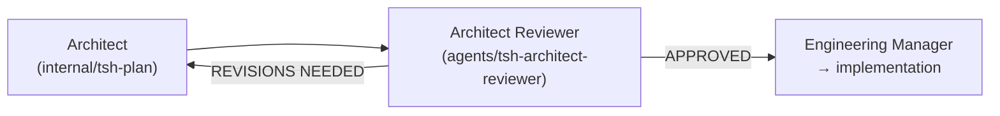

# Architect Reviewer Agent

**File:** `.cursor/skills/agents/tsh-architect-reviewer/SKILL.md`  
**Type:** Internal delegate-only worker (`disable-model-invocation: true`)

The Architect Reviewer is an internal sub-agent that stress-tests implementation plans before code is written. It challenges the plan for likely failure modes, hidden assumptions, sequencing traps, integration mismatches, migration and data risks, and false confidence in testing.

## Responsibilities

- Stress-testing the plan against the research context to expose likely failure modes.
- Checking that referenced files, functions, classes, integrations, and patterns actually exist in the codebase.
- Surfacing hidden assumptions, sequencing traps, dependency order issues, and migration or data risks.
- Challenging integration boundaries, rework risk, and false confidence in test coverage.
- Producing a structured approval or revision report for the Engineering Manager.

## What It Produces

- A failure-oriented review report with a binary verdict, top risks, assumptions, rework triggers, and any blocking gaps.
- The report is saved as `{task-name}.plan-review.md` alongside the plan in `specifications/<task-name>/`.

```text
specifications/
  user-authentication/
    user-authentication.research.md
    user-authentication.plan.md
    user-authentication.plan-review.md    ← new
```

## Severity Levels

| Severity | Definition | Action Required |
| --- | --- | --- |
| **BLOCKER** | Credible execution risk likely to cause failure, major rework, unsafe rollout, or materially wrong outcome | Plan MUST be revised before implementation |
| **WARNING** | Meaningful weakness or assumption that could cause delays or local rework | Should be addressed but does not automatically block |
| **SUGGESTION** | Lower-signal concern with practical value | Nice-to-have only |

## Tool Access

| Tool | Usage |
| --- | --- |
| Context7 | Verify framework or library assumptions when the plan references them |
| Sequential Thinking | Evaluate trade-offs, phase ordering, and execution risks |
| File Read/Search | Inspect the plan, research file, rules, and referenced code |

## Skills Loaded

- `tsh-architecture-designing` — Evaluate architectural shape, phase coherence, and trade-offs.
- `tsh-codebase-analysing` — Verify plan references against the actual codebase.
- `tsh-technical-context-discovering` — Check project conventions and existing patterns.
- `tsh-implementation-gap-analysing` — Compare what exists with what the plan proposes.
- `tsh-sql-and-database-understanding` — When the plan includes database schema, migration, or query changes.

## Invocation

Delegated by the [Engineering Manager](./engineering-manager) via the Cursor **Task** tool (not intended for direct `@tsh-architect-reviewer` use). Load `.cursor/skills/agents/tsh-architect-reviewer/SKILL.md` when validating a plan.

## Handoffs



- **APPROVED** → Engineering Manager presents the plan and a separate chat summary; `*.plan-review.md` stays unchanged.
- **REVISIONS NEEDED with BLOCKERs** → Engineering Manager delegates back to Architect with the review report. Max 3 iterations before escalating to the user.
- **Plan already approved and unchanged** → Re-validation is skipped.
