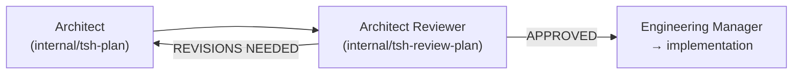

# Architect Reviewer Agent

**File:** `.cursor/skills/agents/tsh-architect-reviewer/SKILL.md`  
**Type:** Internal delegate-only worker (`disable-model-invocation: true`)

The Architect Reviewer validates implementation plans produced by the [Architect](./architect) agent before implementation begins. It is the quality gate between planning and implementation — catching over-engineering, incorrect assumptions, pattern violations, and missing requirements before any code is written.

## Responsibilities

- Reviewing `.plan.md` files for correctness, feasibility, and simplicity.
- Verifying that all research requirements are covered by the plan.
- Checking that referenced files, components, and APIs actually exist in the codebase.
- Detecting over-engineering, unnecessary abstractions, and YAGNI violations.
- Verifying pattern consistency with existing project conventions.
- Evaluating the quality of definitions of done and test plans.
- Producing a structured review report with a final verdict.

## What It Produces

A `{task-name}.plan-review.md` file saved alongside the plan in `specifications/<task-name>/`:

```text
specifications/
  user-authentication/
    user-authentication.research.md
    user-authentication.plan.md
    user-authentication.plan-review.md    ← new
```

The report includes:
- **Verdict** — `APPROVED` or `REVISIONS NEEDED`
- **Findings** — Issues grouped by severity: BLOCKER, WARNING, SUGGESTION
- **Requirement coverage** — Each research requirement mapped to a plan task
- **Codebase verification** — Referenced files/components checked against actual source
- **Simplicity assessment** — Over-engineering and abstraction analysis
- **Pattern consistency** — Alignment with project conventions

## Severity Levels

| Severity | Definition | Action Required |
| --- | --- | --- |
| **BLOCKER** | Incorrect codebase assumption, missing requirement, infeasible approach, security vulnerability, or severe over-engineering | Plan MUST be revised before implementation |
| **WARNING** | Minor inconsistency, suboptimal but functional approach, non-critical missing detail | Should be addressed but does not block |
| **SUGGESTION** | Style preference, alternative worth considering, optional improvement | Nice-to-have only |

## Tool Access

| Tool | Usage |
| --- | --- |
| **Context7** | Verify library features and API versions referenced in the plan |
| **Sequential Thinking** | Evaluate complex architectural trade-offs |
| **File Read/Search** | Verify referenced files, components, and patterns exist in the codebase |

## Skills Loaded

- `tsh-architecture-designing` — Evaluate architectural shape, phase coherence, and trade-offs against requirements.
- `tsh-codebase-analysing` — Verify referenced components against actual codebase state.
- `tsh-technical-context-discovering` — Check pattern consistency against established conventions.
- `tsh-implementation-gap-analysing` — Validate what exists vs. what the plan proposes to build.
- `tsh-sql-and-database-understanding` — Review database-related plan sections: schema design, migrations, indexing.

## Invocation

Delegated by the [Engineering Manager](./engineering-manager) via the Cursor **Task** tool (not intended for direct `@tsh-architect-reviewer` use). The reviewer loads `.cursor/skills/internal/tsh-review-plan/SKILL.md` when validating a plan.

## Handoffs

The Architect Reviewer is the middle step in the planning→implementation chain:



- **APPROVED** → Engineering Manager presents the plan and review summary to the user, then proceeds to implementation.
- **REVISIONS NEEDED with BLOCKERs** → Engineering Manager delegates back to Architect with the review report. Max 3 iterations before escalating to the user.
- **Plan already approved and unchanged** → Re-validation is skipped.
