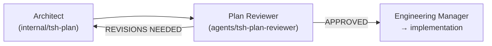

# Plan Reviewer Agent

**File:** `.cursor/skills/agents/tsh-plan-reviewer/SKILL.md`  
**Type:** Internal delegate-only worker (`disable-model-invocation: true`)

The Plan Reviewer (`tsh-plan-reviewer`) is an internal sub-agent that stress-tests implementation plans before code is written. It challenges the plan for likely failure modes, hidden assumptions, sequencing traps, integration mismatches, migration and data risks, and false confidence in testing.

Its `APPROVED` result is **Reviewer approval** only. It reports automated readiness and never grants Human approval or permission to implement; the Engineering Manager must still obtain Human approval of the exact current plan revision before the first file-changing delegation.

The reviewer is non-implementing and does not validate or record the execution precondition. Execution owners validate the persisted Human Approval record before editing; Reviewer approval remains distinct and never authorizes implementation.

## Responsibilities

- Stress-testing the plan against the research context to expose likely failure modes.
- Checking that referenced files, functions, classes, integrations, and patterns actually exist in the codebase.
- Surfacing hidden assumptions, sequencing traps, dependency order issues, and migration or data risks.
- Challenging integration boundaries, rework risk, and false confidence in test coverage.
- Producing a structured approval or revision report for the Architect.

## What It Produces

- A failure-oriented review report with a binary verdict, top risks, assumptions, rework triggers, and any blocking gaps.
- The report is saved as `{task-name}.plan-review.md` alongside the plan in `specifications/<task-name-or-id>/`.

```text
specifications/
  user-authentication/
    user-authentication.research.md
    user-authentication.plan.md
    user-authentication.plan-review.md    ← new
```

## Severity Levels

| Severity | Definition | Action Required |
| --- | --- | --- |
| **BLOCKER** | Credible execution risk likely to cause failure, major rework, unsafe rollout, or materially wrong outcome | Plan MUST be revised before implementation |
| **WARNING** | Meaningful weakness or assumption that could cause delays or local rework | Should be addressed but does not automatically block |
| **SUGGESTION** | Lower-signal concern with practical value | Nice-to-have only |

## Tool Access

| Tool | Usage |
| --- | --- |
| Context7 | Verify framework or library assumptions when the plan references them |
| Sequential Thinking | Evaluate trade-offs, phase ordering, and execution risks |
| File Read/Search | Inspect the plan, research file, rules, and referenced code |

## Skills Loaded

- `tsh-architecture-designing` — Evaluate architectural shape, phase coherence, and trade-offs.
- `tsh-creating-implementation-plans` — Verify plan template, structure, and definition-of-done compliance.
- `tsh-codebase-analysing` — Verify plan references against the actual codebase.
- `tsh-technical-context-discovering` — Check pattern consistency against established conventions.
- `tsh-implementation-gap-analysing` — Compare what exists with what the plan proposes.
- `tsh-sql-and-database-understanding` — When the plan includes database schema, migration, or query changes.

## Invocation

The [Architect](./architect) directly invokes the Plan Reviewer as a nested subagent via the Cursor **Task** tool after creating or revising a plan (not intended for direct `@tsh-plan-reviewer` use); the Engineering Manager is not part of the review loop. Load the `tsh-plan-reviewer` agent skill when validating a plan.

## Handoffs



- **APPROVED** → the Architect reports the finished plan to the Engineering Manager; `*.plan-review.md` stays unchanged.
- **REVISIONS NEEDED with BLOCKERs** → the Architect addresses all BLOCKER findings and re-invokes the reviewer. After 3 iterations, if BLOCKERs remain, the Architect asks the user how to proceed.
- If the reviewer returns revisions, the plan goes back to the Architect and is re-reviewed until the reviewer returns `APPROVED` (Reviewer approval only, never Human approval) or the loop is escalated.
