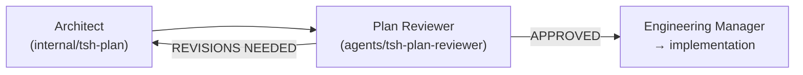

# Plan Reviewer Agent

**File:** `.cursor/skills/agents/tsh-plan-reviewer/SKILL.md`  
**Type:** Internal delegate-only worker (`disable-model-invocation: true`)

The Plan Reviewer (`tsh-plan-reviewer`) is an internal sub-agent that runs a lightweight final pre-implementation reality check on implementation plans before code is written. It answers one question: is there a credible, evidence-backed reason this plan will fail badly, be unsafe, or cause expensive rework? A short `APPROVED` is the expected common outcome.

Its `APPROVED` result is **Reviewer approval** only. It reports automated readiness and never grants Human approval or permission to implement; the Engineering Manager must still obtain Human approval of the exact current plan revision before the first file-changing delegation.

The reviewer is non-implementing and does not validate or record the execution precondition. Execution owners validate the persisted Human Approval record before editing; Reviewer approval remains distinct and never authorizes implementation.

## Responsibilities

- Checking the plan against the research context for material architecture, security, and execution risk.
- Checking that referenced files, functions, classes, integrations, and patterns actually exist in the codebase.
- Surfacing hidden assumptions, sequencing traps, dependency order issues, and migration or data risks.
- Challenging integration boundaries, rework risk, and false confidence in test coverage.
- Producing a structured approval or revision report for the Architect.

## What It Produces

- A failure-oriented review report with a binary verdict, top risks, assumptions, rework triggers, and any blocking gaps.
- The report is saved as `{task-name}.plan-review.md` alongside the plan in `specifications/<task-name-or-id>/`, with the reviewed `Plan Revision` recorded in the report header.
- The returned assessment carries a `reviewed-plan-revision` attribute holding the integer `Plan Revision` read verbatim from the plan's `## Human Approval` table; if it cannot be read, the reviewer returns `REVISIONS NEEDED` with `reviewed-plan-revision="unknown"`.
- The returned assessment carries `architect-action-required="false"` on `APPROVED` and `architect-action-required="true"` on `REVISIONS NEEDED`.
- The returned `short summary` is fenced to the verdict, the single highest-signal reason, and the blocker/warning/suggestion counts; it never mentions human approval, user consent, or execution authorization.

## Blocker Criteria

`BLOCKER` eligibility is limited to exactly six high-level categories: materially invalid architecture; security, privacy, or authentication risk; unsupported irreversible or high-cost decisions; critical integration, data, migration, rollout, or rollback failure; an execution-critical unresolved decision; and material contradiction with research or an omitted requirement. No other category is a `BLOCKER`. `WARNING` and `SUGGESTION` findings are non-blocking and never escalate merely because they repeat.

Each finding states the violated criterion, evidence, consequence, and minimum correction — the reviewer never redesigns the plan. An unresolved `BLOCKER` closes only through an architect correction or a recorded explicit evidence-based resolution or justification, never through omission or an unexplained downgrade. The reviewer never approves a plan while a `BLOCKER` remains, and every review is appended to `{task-name}.plan-review.md` as part of its append-only history.

```text
specifications/
  user-authentication/
    user-authentication.research.md
    user-authentication.plan.md
    user-authentication.plan-review.md    ← new
```

## Severity Levels

| Severity | Definition | Action Required |
| --- | --- | --- |
| **BLOCKER** | Credible execution risk matching one of the six canonical blocker categories above | Plan MUST be revised before implementation |
| **WARNING** | Meaningful weakness or assumption that could cause delays or local rework | Should be addressed but does not automatically block |
| **SUGGESTION** | Lower-signal concern with practical value | Nice-to-have only |

## Tool Access

| Tool | Usage |
| --- | --- |
| Context7 | Verify framework or library assumptions when the plan references them |
| Sequential Thinking | Evaluate trade-offs, phase ordering, and execution risks |
| File Read/Search | Inspect the plan, research file, rules, and referenced code |

## Skills Loaded

- `tsh-creating-implementation-plans` — Verify plan template, structure, and definition-of-done compliance.
- `tsh-codebase-analysing` — Verify plan references against the actual codebase.
- `tsh-technical-context-discovering` — Check pattern consistency against established conventions.
- `tsh-implementation-gap-analysing` — Compare what exists with what the plan proposes.

## Invocation

The [Architect](./architect) directly invokes the Plan Reviewer as a nested subagent via the Cursor **Task** tool after creating or revising a plan, with one invocation per plan lifecycle (not intended for direct `@tsh-plan-reviewer` use); the Engineering Manager is not part of the review loop. Load the `tsh-plan-reviewer` agent skill when validating a plan.

## Handoffs



- **APPROVED** → the Architect reports the finished plan to the Engineering Manager; `*.plan-review.md` stays unchanged.
- **REVISIONS NEEDED with BLOCKERs** → the Architect writes a disposition for every eligible BLOCKER and corrects the plan; the reviewer is never re-invoked automatically.
- The Architect accepts a verdict only when its `reviewed-plan-revision` matches the current `Plan Revision`; a mismatch, `unknown`, or absent value is rejected and logged as a reconciliation entry in `.plan-review.md` without re-invoking the reviewer.
- If an unresolved BLOCKER remains after disposition, the Architect asks the user in chat which of exactly two options to take, naming both in prose: `stop here` or `custom guidance`. A new review happens only through an explicitly user-directed new review event. `APPROVED` remains Reviewer approval only, never Human approval.
